# Hyrcania Cloud Infrastructure

## Project Overview

Hyrcania Cloud Infrastructure is an end-to-end cloud engineering and DevOps project demonstrating how a modern application infrastructure can be designed, automated, secured, validated, and managed using industry-standard technologies.

The project combines:

- Microsoft Azure
- Terraform Infrastructure as Code
- GitHub Actions CI/CD
- Microsoft Entra ID / Azure OIDC
- Docker and Docker Compose
- Python
- PostgreSQL
- Ubuntu Linux
- Cloud networking and security
- Monitoring and backup

The project follows a production-inspired approach where infrastructure is defined as code, infrastructure changes are automatically validated, Terraform plans are reviewed before deployment, and GitHub Actions authenticates with Azure using federated identity.

The project is also designed with cost awareness in mind. Azure resources can be deployed temporarily for testing and then removed, while the CI/CD pipeline can continue demonstrating Terraform validation, planning, authentication, and deployment governance without maintaining continuously running Azure infrastructure.

---

# Architecture Overview

The project is designed as one unified cloud engineering platform.

The complete architecture connects the development workflow, CI/CD pipeline, infrastructure automation, Azure networking, application platform, database, monitoring, and security components.

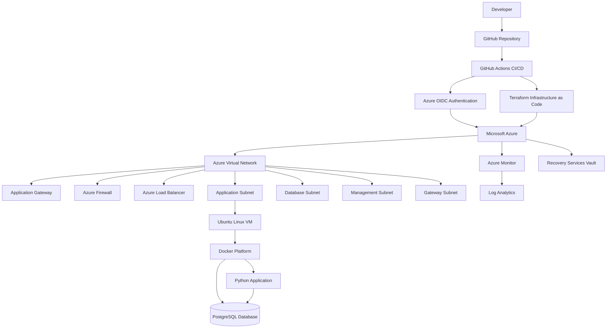

The overall engineering flow is:

**Developer → GitHub → CI/CD → Azure OIDC → Terraform → Azure → Network → Application Platform → Database → Monitoring**

---

# Project Goals

The main objectives of Hyrcania Cloud Infrastructure are to demonstrate practical experience with:

- Cloud infrastructure design
- Infrastructure as Code
- Terraform
- CI/CD automation
- GitHub Actions
- Azure OIDC authentication
- Microsoft Entra ID
- Azure networking
- Network security
- Docker
- Docker Compose
- Linux administration
- Application deployment
- Monitoring
- Backup and recovery
- Infrastructure governance
- Cost-aware cloud engineering

The project simulates how a real engineering team could design, validate, review, and deploy cloud infrastructure using automated and repeatable processes.

---

# Architecture Layers

## 1. DevOps and CI/CD Layer

GitHub acts as the central version-control and automation platform.

GitHub Actions is responsible for validating infrastructure changes and generating Terraform plans.

The CI/CD layer includes:

- GitHub repository
- GitHub Actions
- Terraform
- Azure OIDC
- Terraform plan artifacts
- GitHub Environments
- Manual approval
- Deployment governance

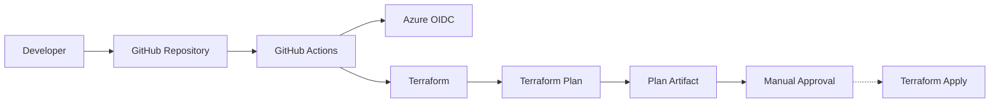

The pipeline is designed so that infrastructure changes can be validated and reviewed before deployment.

---

# 2. Infrastructure as Code Layer

Terraform is used as the infrastructure automation layer.

Instead of manually creating cloud resources through the Azure Portal, infrastructure is represented as version-controlled code.

Terraform manages resources such as:

- Resource Groups
- Virtual Networks
- Subnets
- Network Security Groups
- Azure Firewall
- Application Gateway
- Load Balancer
- Public IP addresses
- Virtual Machines
- Storage Accounts
- Monitoring resources
- Backup resources

The Terraform lifecycle is:

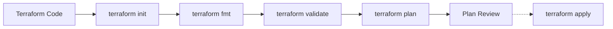

Terraform provides:

- Reproducibility
- Version control
- Automated infrastructure
- Consistent configuration
- Reduced manual errors
- Change visibility
- Infrastructure validation

Terraform documentation:

https://github.com/Zhenyaof/Hyrcania-Cloud-Infrastructure/blob/main/terraform/README.md

---

# 3. Cloud Infrastructure Layer

Microsoft Azure provides the infrastructure foundation.

The Azure architecture contains several logical components.

## Azure Resources

The infrastructure includes:

- Azure Resource Group
- Azure Virtual Network
- Application subnet
- Database subnet
- Management subnet
- Gateway subnet
- Network Security Groups
- Azure Firewall
- Application Gateway
- Load Balancer
- Public IP resources
- Ubuntu Linux Virtual Machine
- Storage Account
- Log Analytics Workspace
- Azure Monitor
- Recovery Services Vault

The Azure infrastructure provides:

- Compute
- Networking
- Traffic management
- Security
- Monitoring
- Backup
- Storage

---

# 4. Application Platform Layer

The application platform runs on top of the Azure infrastructure.

The workload is containerized using Docker.

The application platform consists of:

- Ubuntu Linux
- Docker Engine
- Docker Compose
- Python application
- PostgreSQL database
- Container networking
- Health checks
- Persistent application data

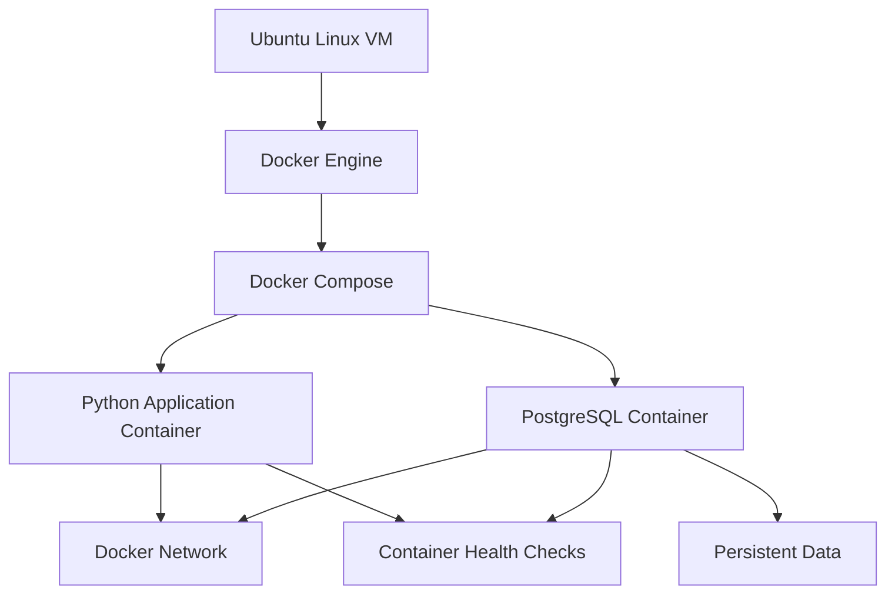

Docker documentation:

https://github.com/Zhenyaof/Hyrcania-Cloud-Infrastructure/blob/main/docker/README.md

---

# 5. Networking and Security Layer

The Azure network follows a segmented architecture.

The main network areas are:

- Application
- Database
- Management
- Gateway

The network architecture is designed to separate workloads and control communication between different parts of the environment.

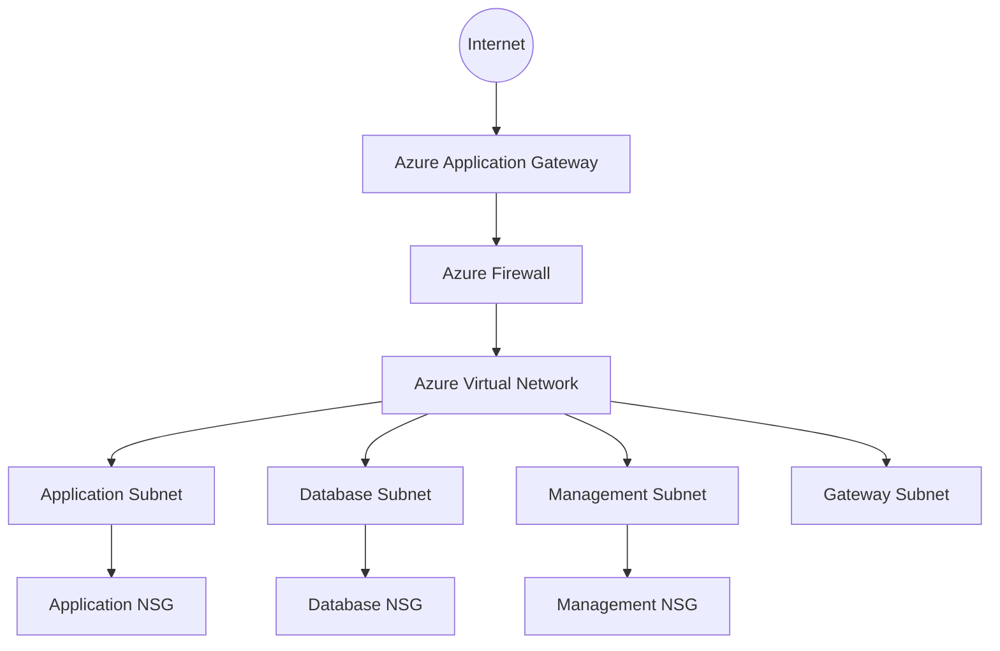

Security principles demonstrated include:

- Network segmentation
- Controlled traffic flows
- Network Security Groups
- Azure Firewall
- Restricted administrative access
- Separation of application and database workloads
- Least-privilege principles

---

# 6. Monitoring and Reliability Layer

Operational visibility is an important part of the infrastructure.

The project includes monitoring and recovery capabilities.

Components include:

- Azure Monitor
- Log Analytics Workspace
- Recovery Services Vault
- VM backup
- Docker health checks

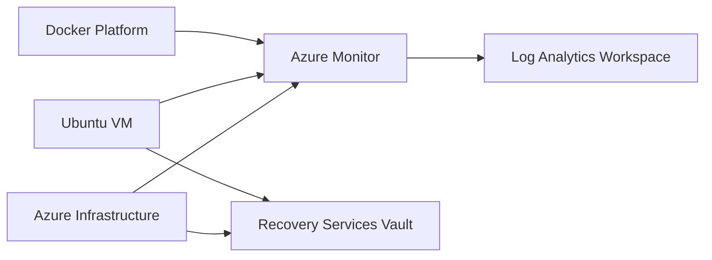

These services provide:

- Infrastructure visibility
- Centralized logging
- Troubleshooting
- Backup and recovery
- Application health monitoring

---

# CI/CD Pipeline

The CI/CD pipeline is implemented using GitHub Actions.

Workflow file:

`.github/workflows/ci.yml`

The pipeline is divided conceptually into CI and CD stages.

```text
CI
│
├── Checkout Repository
├── Setup Terraform
├── Azure OIDC Authentication
├── Terraform Init
├── Terraform Format Check
├── Terraform Validate
├── Terraform Plan
└── Upload Terraform Plan
        │
        ▼
CD
│
├── Download Terraform Plan
├── Verify Plan
├── Display Plan
├── Production Environment
├── Manual Approval
└── Controlled Deployment
```

---

# Continuous Integration

The CI stage validates infrastructure changes.

The workflow performs:

1. Checkout repository
2. Setup Terraform
3. Authenticate with Azure
4. Initialize Terraform
5. Check Terraform formatting
6. Validate Terraform configuration
7. Generate Terraform plan
8. Save the Terraform plan
9. Upload the plan as a GitHub Actions artifact

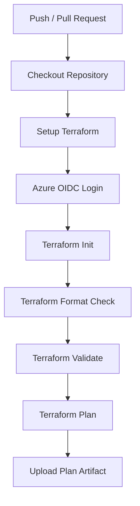

This ensures infrastructure changes are validated before entering the deployment stage.

---

# Continuous Delivery

The CD stage takes the Terraform plan generated by CI and makes it available for human review.

The CD workflow performs:

- Download Terraform plan
- Initialize Terraform
- Verify the plan artifact
- Display the Terraform plan
- Enter the protected environment
- Require manual approval

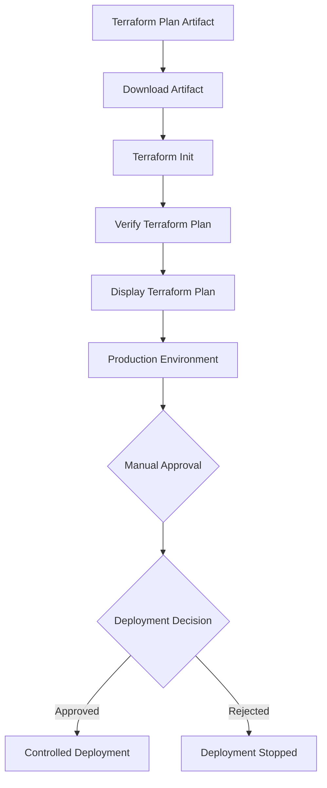

---

# Azure OIDC Authentication

GitHub Actions authenticates with Azure using OpenID Connect.

Instead of storing a long-lived Azure client secret in GitHub Actions, GitHub obtains a short-lived identity token and exchanges it with Microsoft Entra ID.

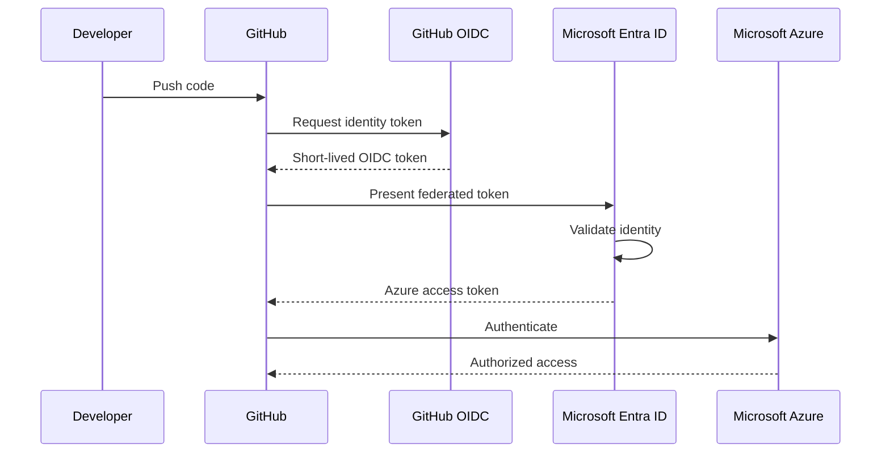

Benefits include:

- Passwordless authentication
- Short-lived tokens
- No long-lived Azure credentials
- Federated identity
- Improved CI/CD security
- Reduced credential-management overhead

---

# GitHub Environment Protection

The CD workflow uses a protected GitHub environment:

`production`

The environment can require human approval before deployment.

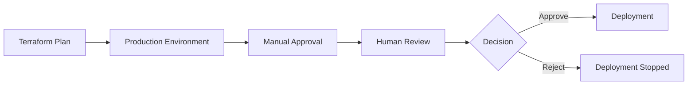

This introduces a human-controlled deployment gate and helps prevent accidental infrastructure changes.

---

# Cost Management

Cost management is an important part of this project.

The Azure infrastructure was deployed temporarily to test and validate the Terraform and CI/CD implementation.

After testing, the Azure resources were removed.

The project can therefore demonstrate:

- Terraform
- Azure authentication
- OIDC
- Terraform validation
- Terraform planning
- CI/CD
- Plan artifacts
- Manual approval
- Deployment governance

without requiring continuously running Azure infrastructure.

The cost-aware workflow is:

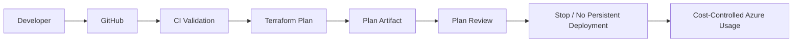

This allows the project to demonstrate real DevOps and cloud engineering practices without unnecessarily maintaining paid Azure resources.

---

# Technology Stack

| Category | Technology |
|---|---|
| Cloud Platform | Microsoft Azure |
| Infrastructure as Code | Terraform |
| CI/CD | GitHub Actions |
| Cloud Authentication | Microsoft Entra ID / Azure OIDC |
| Containers | Docker |
| Container Orchestration | Docker Compose |
| Application Runtime | Python |
| Database | PostgreSQL |
| Operating System | Ubuntu Linux |
| Version Control | Git / GitHub |
| Monitoring | Azure Monitor |
| Logging | Log Analytics |
| Backup | Recovery Services Vault |
| Network Security | NSG / Azure Firewall |
| Application Delivery | Azure Application Gateway |
| Load Balancing | Azure Load Balancer |

---

# Implementation Highlights

## Cloud Infrastructure

Implemented Azure components include:

- Resource Group
- Virtual Network
- Multiple Subnets
- Network Security Groups
- Ubuntu Virtual Machine
- Storage Account
- Load Balancer
- Application Gateway
- Azure Firewall
- Public IP resources
- Log Analytics Workspace
- Recovery Services Vault

Detailed Azure documentation:

https://github.com/Zhenyaof/Hyrcania-Cloud-Infrastructure/blob/main/azure/README.md

---

# Terraform Implementation

Terraform configuration contains:

- Azure provider configuration
- Resource definitions
- Variables
- Outputs
- Network infrastructure
- Compute infrastructure
- Security configuration
- Monitoring configuration

Typical Terraform commands:

```bash
terraform init
terraform fmt
terraform validate
terraform plan
```

The CI/CD workflow separates infrastructure planning from controlled deployment.

---

# Docker Implementation

The application platform uses Docker to package and run application services.

The Docker environment contains:

- Python application
- PostgreSQL
- Docker Compose
- Container networking
- Health checks
- Persistent storage

Common commands:

```bash
docker compose up -d
docker ps
docker compose logs
docker compose down
```

---

# Deployment Workflow

The overall deployment workflow is:

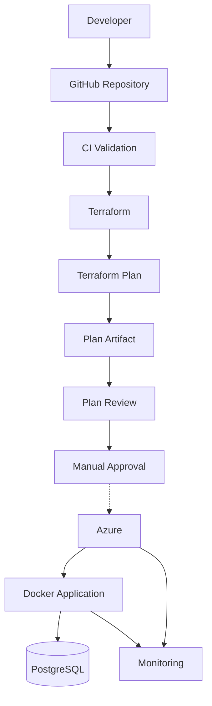

---

# Repository Structure

```text
Hyrcania-Cloud-Infrastructure/

├── .github/
│   └── workflows/
│       └── ci.yml
│
├── azure/
│   └── README.md
│
├── terraform/
│   ├── README.md
│   ├── main.tf
│   ├── variables.tf
│   ├── outputs.tf
│   └── ...
│
├── docker/
│   ├── README.md
│   ├── Dockerfile
│   ├── docker-compose.yml
│   └── ...
│
├── docs/
│   ├── Architecture.md
│   └── Deployment.md
│
├── screenshots/
│   ├── azure/
│   └── docker/
│
└── README.md
```

---

# Security Considerations

Security was considered throughout the infrastructure and automation architecture.

Implemented security practices include:

- Azure Virtual Network isolation
- Subnet segmentation
- Network Security Groups
- Azure Firewall
- Controlled administrative access
- Azure OIDC authentication
- Federated identity credentials
- No long-lived Azure credentials in GitHub Actions
- GitHub Environment protection
- Infrastructure as Code
- Version-controlled infrastructure
- Separation of validation and deployment
- Controlled Terraform deployment

---

# Monitoring and Reliability

The infrastructure includes operational components for reliability:

- Azure Monitor
- Log Analytics Workspace
- Recovery Services Vault
- VM backup
- Docker health checks

These components provide:

- Infrastructure visibility
- Centralized logging
- Troubleshooting capability
- Backup and recovery
- Application health monitoring

---

# Screenshots and Evidence

Deployment and development evidence is stored inside:

```text
screenshots/

├── azure/
└── docker/
```

Screenshots can demonstrate:

- Azure resource deployment
- Terraform configuration
- Terraform plan
- GitHub Actions CI/CD
- Azure OIDC authentication
- Docker containers
- Application availability
- Infrastructure validation
- Deployment workflow

---

# Engineering Skills Demonstrated

## Cloud Engineering

- Microsoft Azure
- Cloud resource management
- Virtual networking
- Cloud security
- Monitoring
- Backup and recovery

## Infrastructure as Code

- Terraform
- Automated provisioning
- Infrastructure validation
- Infrastructure planning
- Configuration management
- Version-controlled infrastructure

## DevOps / CI/CD

- GitHub Actions
- CI/CD pipeline design
- Terraform automation
- Terraform plan artifacts
- Manual approval gates
- Deployment governance
- GitHub Environments

## Cloud Security

- Microsoft Entra ID
- Azure OIDC
- Federated Identity Credentials
- Passwordless authentication
- Network Security Groups
- Azure Firewall
- Network segmentation

## Networking

- Azure VNet design
- Subnet segmentation
- Traffic management
- Load balancing
- Application Gateway
- Security rules

## Containers

- Docker
- Docker Compose
- Container networking
- Application packaging
- Health checks
- Persistent storage

## Linux Administration

- Ubuntu server administration
- Linux services
- Command-line operations
- Application hosting
- Server management

---

# Future Improvements

Possible future extensions include:

- Azure Storage remote Terraform backend
- Terraform state locking
- Controlled Terraform Apply workflow
- Terraform Destroy workflow
- Azure Key Vault integration
- Advanced Azure monitoring dashboards
- Automated security scanning
- Terraform linting
- Static infrastructure analysis
- Container vulnerability scanning
- Kubernetes migration
- High availability improvements
- Disaster recovery improvements
- Multi-environment Terraform configuration
- Development / staging / production environments

---

# Project Workflow Summary

The complete engineering workflow is:

**Design → Code → Version Control → CI Validation → Terraform Plan → Plan Review → Deployment Governance → Cloud Infrastructure → Application Platform → Database → Monitoring**

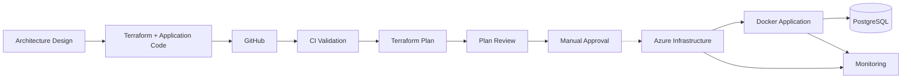

The dotted deployment connection represents the controlled deployment path.

---

# Summary

Hyrcania Cloud Infrastructure demonstrates a complete modern cloud engineering workflow:

**Design → Infrastructure as Code → Cloud Deployment → Containerization → CI/CD → Security → Monitoring → Documentation**

The project combines:

- Microsoft Azure
- Terraform
- GitHub Actions
- Azure OIDC
- Microsoft Entra ID
- Docker
- Python
- PostgreSQL
- Ubuntu Linux
- Networking
- Security
- Monitoring
- Infrastructure automation

The architecture demonstrates how infrastructure and application workloads can be managed through Infrastructure as Code and CI/CD while maintaining:

- Security
- Reproducibility
- Automation
- Deployment governance
- Operational visibility
- Cost awareness

The current implementation focuses on validation, planning, authentication, security, and deployment governance while avoiding unnecessary persistent Azure costs.

---

# Project Status

| Component | Status |
|---|---|
| Azure Architecture | Implemented |
| Terraform Infrastructure | Implemented |
| Docker Platform | Implemented |
| GitHub Actions CI | Implemented |
| Terraform Plan | Implemented |
| Azure OIDC Authentication | Implemented |
| GitHub Environment Protection | Implemented |
| Manual Approval | Implemented |
| Monitoring Architecture | Implemented |
| Backup Architecture | Implemented |
| Cost-Controlled Deployment | Implemented |
| Kubernetes | Future Improvement |

**Status:** Active Development

**Cloud:** Microsoft Azure

**Infrastructure:** Terraform

**CI/CD:** GitHub Actions

**Authentication:** Azure OIDC / Microsoft Entra ID

**Application Platform:** Docker

**Database:** PostgreSQL

**Operating System:** Ubuntu Linux

**Deployment Strategy:** Controlled and Cost-Aware

**Azure Resources:** Removed after testing to avoid unnecessary ongoing costs
