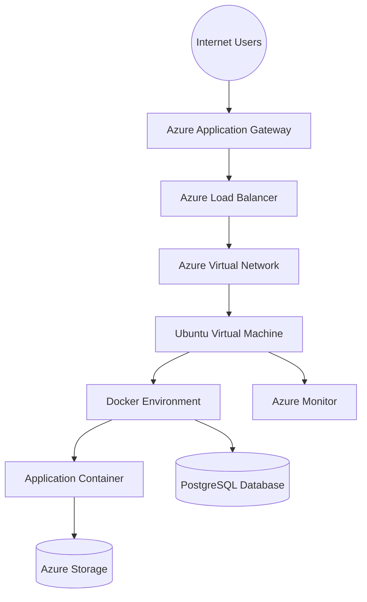
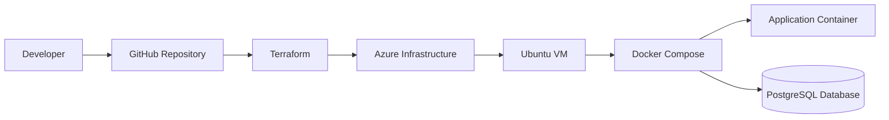

# Hyrcania Cloud Infrastructure

## Project Overview

Hyrcania Cloud Infrastructure is an end-to-end cloud engineering project that demonstrates the design, deployment, and documentation of a production-inspired cloud environment.

The project focuses on building a secure, scalable, and maintainable infrastructure using:

- Microsoft Azure
- Terraform Infrastructure as Code
- Docker containerization
- Linux administration
- Cloud networking and security principles

The main objective is to simulate how a real-world organization could design and deploy application infrastructure using automated and repeatable processes.

---

# Project Motivation

Modern applications require infrastructure that is secure, scalable, and easy to maintain.

Manually creating cloud resources can lead to configuration inconsistencies and makes environments difficult to reproduce.

This project demonstrates how a cloud environment can be designed using modern engineering practices:

- Infrastructure as Code
- Cloud networking principles
- Containerized application deployment
- Security-focused architecture
- Automated and repeatable deployments

The goal is to simulate a real-world cloud infrastructure environment where an application can be deployed, monitored, and maintained efficiently.

---

# Architecture Overview

The infrastructure is designed around several major layers:

## Cloud Infrastructure Layer

Microsoft Azure provides the foundation of the environment.

The Azure infrastructure includes:

- Azure Virtual Network
- Subnet segmentation
- Network Security Groups
- Azure Firewall
- Application Gateway
- Load Balancer
- Ubuntu Virtual Machine
- Storage services
- Monitoring and backup solutions

---

## Infrastructure as Code Layer

Terraform is used to automate Azure infrastructure provisioning.

Instead of manually creating resources through the Azure Portal, infrastructure is defined as code.

Benefits:

- Version-controlled infrastructure
- Repeatable deployments
- Reduced configuration errors
- Easier maintenance
- Automated resource provisioning

Terraform documentation:

➡️ [Terraform Documentation](terraform/README.md)

---

## Application Platform Layer

The application environment is deployed using Docker.

The containerized architecture includes:

- Python application container
- PostgreSQL database container
- Docker Compose orchestration
- Container networking
- Health monitoring

Docker documentation:

➡️ [Docker Documentation](docker/README.md)

---

# High-Level Architecture



---

# Design Philosophy

The architecture was designed around four main principles.

---

## 1. Automation First

Terraform is used as the foundation for infrastructure deployment.

All major Azure resources are defined through code, allowing the environment to be recreated consistently.

Benefits:

- Version-controlled infrastructure
- Repeatable deployments
- Reduced manual configuration
- Easier troubleshooting

---

## 2. Secure Network Architecture

The Azure environment follows network segmentation principles.

Resources are separated into logical layers:

- Web layer
- Application layer
- Database layer
- Management layer

Security controls include:

- Network Security Groups
- Azure Firewall
- Secure administrative access
- Controlled network communication

---

## 3. Containerized Application Deployment

The application workload is deployed using Docker.

The container approach provides:

- Application isolation
- Portable deployments
- Simplified dependency management
- Easier scaling and maintenance

The Docker environment consists of:

- Python application container
- PostgreSQL database container
- Docker Compose orchestration

---

## 4. Operational Visibility

A production environment requires monitoring and recovery capabilities.

The infrastructure includes:

- Azure Monitor
- Log Analytics
- Backup services
- Container health checks

These components provide visibility into system performance and improve reliability.

---

# Technology Stack

| Category | Technology |
|---|---|
| Cloud Platform | Microsoft Azure |
| Infrastructure Automation | Terraform |
| Containers | Docker |
| Application Runtime | Python |
| Database | PostgreSQL |
| Operating System | Ubuntu Linux |
| Version Control | Git & GitHub |
| Monitoring | Azure Monitor |
| Security | NSG, Azure Firewall, Bastion |

---

# Implementation Highlights

## Cloud Infrastructure

Implemented Azure components:

- Resource Group
- Virtual Network
- Multiple Subnets
- Network Security Groups
- Virtual Machine
- Storage Account
- Load Balancer
- Application Gateway
- Azure Firewall
- Monitoring Services
- Backup Services

Detailed Azure documentation:

➡️ [Azure Documentation](azure/README.md)

---

## Infrastructure Automation

Terraform implementation includes:

- Azure Provider configuration
- Resource definitions
- Variables
- Outputs
- Infrastructure organization

Deployment commands:

```bash
terraform init

terraform validate

terraform plan

terraform apply
```

Detailed Terraform documentation:

➡️ [Terraform Documentation](terraform/README.md)

---

## Container Platform

Docker implementation includes:

- Custom application image
- Docker Compose orchestration
- PostgreSQL integration
- Container health checks
- Persistent data management

Common commands:

```bash
docker compose up -d

docker ps

docker compose logs
```

Detailed Docker documentation:

➡️ [Docker Documentation](docker/README.md)

---

# Deployment Workflow

The complete deployment process follows this workflow:



Detailed deployment guide:

➡️ [Deployment Documentation](docs/Deployment.md)

---

# Repository Structure

```
Hyrcania-Cloud-Infrastructure/

├── azure/
│   └── Azure infrastructure documentation
│
├── terraform/
│   └── Infrastructure as Code configuration
│
├── docker/
│   └── Container deployment configuration
│
├── docs/
│   ├── Architecture documentation
│   └── Deployment guide
│
├
│   
│
├── screenshots/
│   ├── azure/
│   └── docker/
│
└── README.md
```

---

# Security Considerations

Security was considered throughout the infrastructure design.

Implemented security practices:

- Azure Virtual Network isolation
- Subnet segmentation
- Network Security Groups
- Azure Firewall protection
- Controlled administrative access
- Environment variable based configuration
- Secure application deployment practices

---

# Monitoring and Reliability

The infrastructure includes operational components for reliability:

- Azure Monitor
- Log Analytics Workspace
- Recovery Services Vault
- VM backup configuration
- Docker health checks

These services provide:

- Infrastructure visibility
- Troubleshooting capability
- Backup and recovery support
- Improved availability

---

# Screenshots and Evidence

Deployment evidence is stored inside:

```
screenshots/

├── azure/
│
└── docker/
```

The screenshots demonstrate:

- Azure resource deployment
- Running Docker containers
- Application availability
- Infrastructure validation

---

# Engineering Skills Demonstrated

This project demonstrates practical skills across:

## Cloud Engineering

- Microsoft Azure
- Cloud resource management
- Virtual networking
- Cloud security
- Monitoring

## Infrastructure as Code

- Terraform
- Automated provisioning
- Configuration management
- Infrastructure organization

## Networking

- VNet design
- Subnetting
- Traffic management
- Security rules

## Containers

- Docker
- Docker Compose
- Container networking
- Application packaging

## Linux Administration

- Ubuntu server management
- Service monitoring
- Command-line operations

---

# Future Improvements

Possible future extensions:

- CI/CD pipeline integration
- Automated Terraform deployments
- Advanced monitoring dashboards
- Kubernetes migration
- Additional cloud security improvements
- High availability improvements

---

# Summary

Hyrcania Cloud Infrastructure demonstrates a complete cloud engineering workflow:

**Design → Infrastructure as Code → Cloud Deployment → Containerization → Monitoring → Documentation**

The project combines Azure, Terraform, Docker, networking, and security concepts to create a realistic cloud infrastructure environment.
