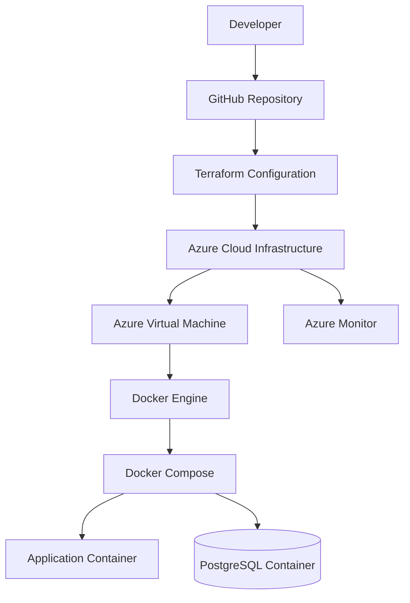
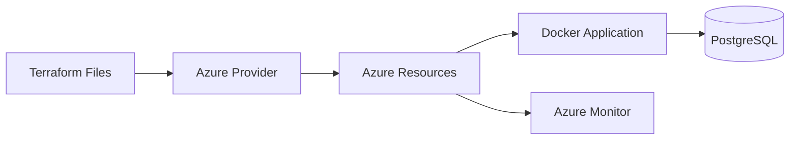

# Hyrcania Cloud Infrastructure Deployment Guide

## Overview

This document explains the complete deployment workflow of the Hyrcania Cloud Infrastructure project.

The deployment process follows Infrastructure as Code (IaC) and containerization principles:

1. Provision Azure infrastructure using Terraform
2. Configure cloud resources
3. Deploy application containers using Docker
4. Validate and monitor the environment

---

# Deployment Workflow



---

# Prerequisites

Before deployment, install:

- Git
- Azure CLI
- Terraform
- Docker Desktop


Verify installations:

## Azure CLI

```bash
az --version
```

## Terraform

```bash
terraform version
```

## Docker

```bash
docker --version
```

---

# Phase 1 — Clone Repository

Clone the project:

```bash
git clone https://github.com/Zhenyaof/Hyrcania-Cloud-Infrastructure.git
```

Navigate into the project:

```bash
cd Hyrcania-Cloud-Infrastructure
```

---

# Phase 2 — Azure Authentication

Login to Azure:

```bash
az login
```

Verify subscription:

```bash
az account show
```

---

# Phase 3 — Infrastructure Deployment With Terraform

Navigate to Terraform directory:

```bash
cd terraform
```

Initialize Terraform:

```bash
terraform init
```

Validate configuration:

```bash
terraform validate
```

Create deployment plan:

```bash
terraform plan
```

Deploy infrastructure:

```bash
terraform apply
```

Terraform provisions:

- Resource Group
- Virtual Network
- Subnets
- Security Groups
- Virtual Machine
- Storage Account
- Load Balancer
- Application Gateway
- Firewall
- Monitoring Services
- Backup Services

---

# Phase 4 — Docker Application Deployment

Navigate to Docker directory:

```bash
cd ../docker
```

Build application image:

```bash
docker build -t hyrcania-app .
```

Start application stack:

```bash
docker compose up -d
```

Verify running containers:

```bash
docker ps
```

Expected services:

```
Application Container
PostgreSQL Database Container
```

---

# Phase 5 — Application Verification

Check application logs:

```bash
docker logs hyrcania-app
```

Check database logs:

```bash
docker logs hyrcania-db
```

Check container health:

```bash
docker ps
```

The containers should show:

```
STATUS: Healthy
```

---

# Phase 6 — Infrastructure Validation

Verify Azure resources:

```bash
az resource list
```

Check Terraform outputs:

```bash
terraform output
```

Validate:

- Network connectivity
- VM availability
- Storage accessibility
- Monitoring configuration
- Security rules

---

# Deployment Architecture



---

# Rollback Process

If deployment problems occur:

## Destroy Terraform Infrastructure

```bash
terraform destroy
```

## Stop Docker Services

```bash
docker compose down
```

---

# Maintenance Commands

## Update Containers

```bash
docker compose up -d --build
```

## View Logs

```bash
docker compose logs
```

## Check Running Services

```bash
docker compose ps
```

---

# Deployment Summary

The Hyrcania Cloud Infrastructure deployment process demonstrates:

✅ Infrastructure as Code with Terraform  
✅ Azure cloud resource provisioning  
✅ Containerized application deployment  
✅ Database integration  
✅ Cloud monitoring  
✅ Secure network architecture  

This workflow provides a repeatable and scalable deployment model suitable for modern cloud environments.
